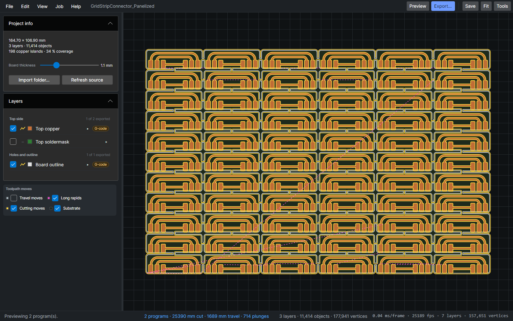
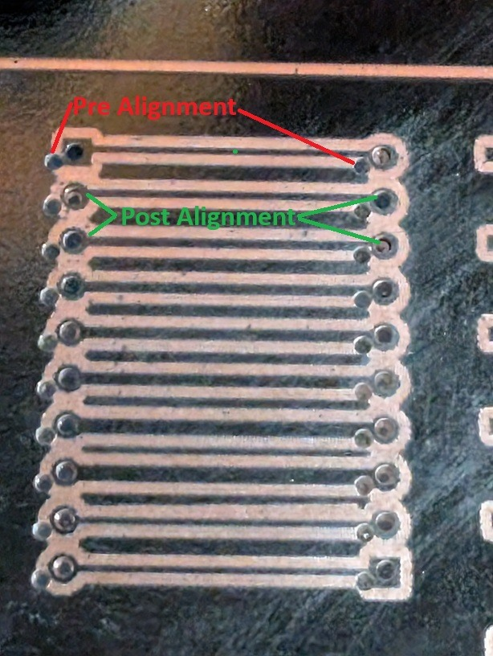
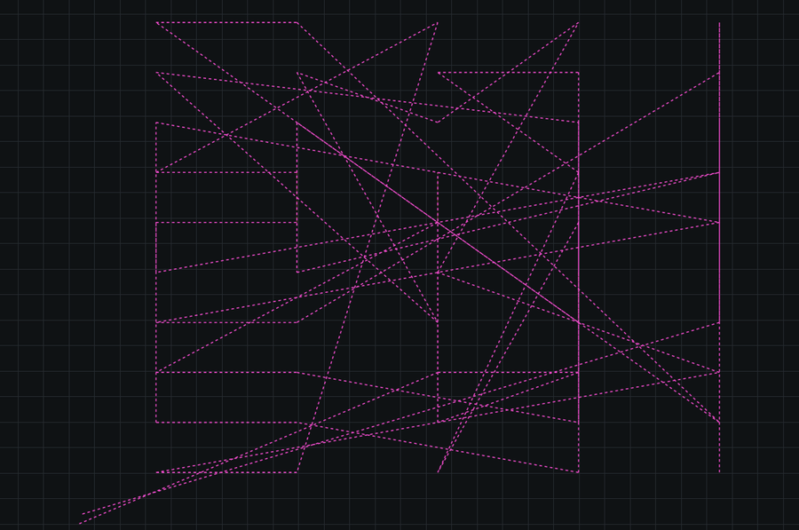
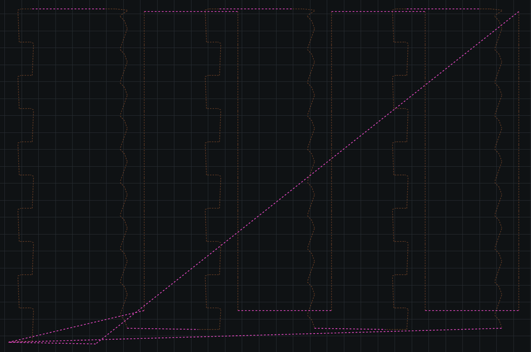
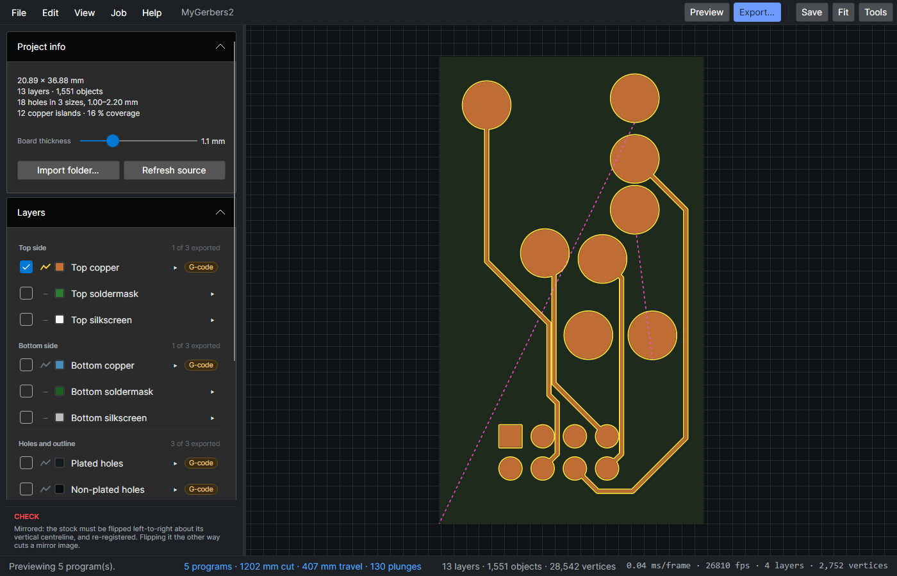
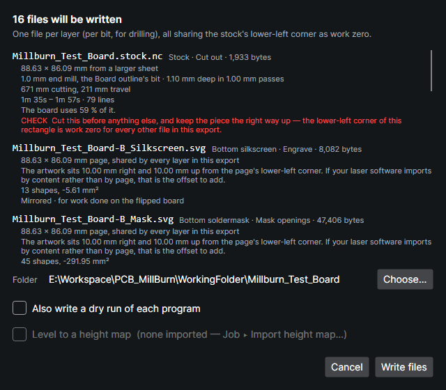
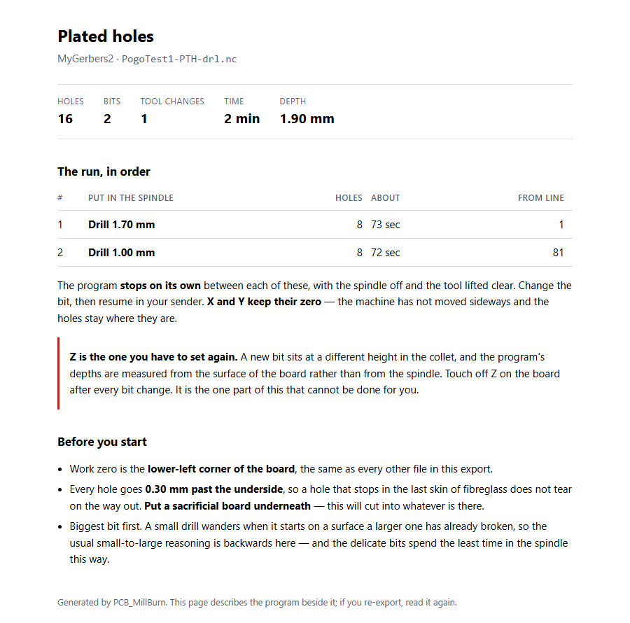
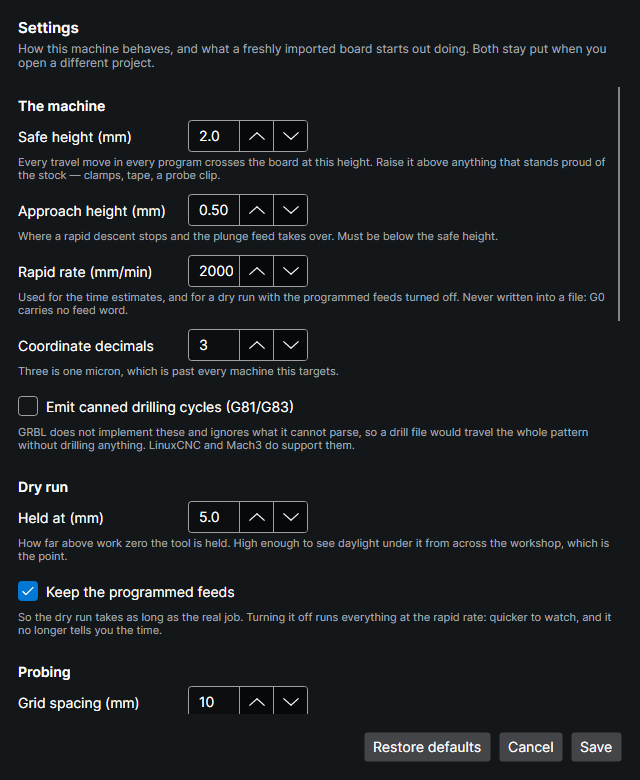
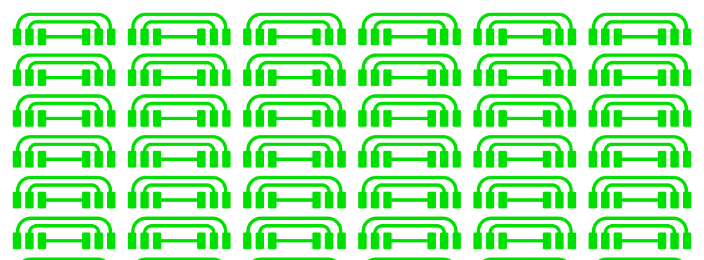
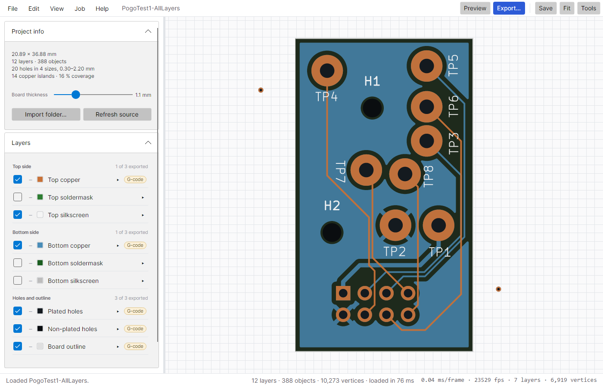

<div align="center">
  
  <h1>PCB_MillBurn</h1>
  <p>
    <b>Turn your Gerber files into a circuit board.</b><br>
    G-code for the mill. SVG for the laser. One app, one board, no guesswork.
  </p>
  <p>
    <a href="https://github.com/kitecraft/PCB_MillBurn/releases/latest"></a>
    <a href="https://github.com/kitecraft/PCB_MillBurn/actions/workflows/build.yml"></a>
    <a href="LICENSE"></a>
    <a href="#build-it-yourself"></a>
    <a href="THIRD-PARTY-NOTICES.md"></a>
  </p>
  <p>
    <a href="https://github.com/kitecraft/PCB_MillBurn/releases/latest"><b>Download</b></a> ·
    <a href="#quick-start">Quick start</a> ·
    <a href="#status">What has been proven on metal</a> ·
    <a href="Documentation/README.md">Design docs</a>
  </p>
</div>



<sub>A 66-up panel — 11,414 objects, 198 copper islands — with the emitted isolation and cut-out programs drawn back over the copper they were made from.</sub>

---

## What it does

Drop a folder of Gerbers on the window. The board appears. Tell each layer what it should become.
Press Export.

- **Mill it.** Isolation routing, drilling one file per bit, slots and oversized holes routed with an
  end mill, soldermask relief, cut-out with tabs — and, if you like, the copper-clad cut to size first
  so its edges become the datum for everything after.
- **Burn it.** Laser-ready SVG at true 1:1 millimetres, for LightBurn or Inkscape.
- **Or both.** Make the copper with the laser, then drill and cut out on the mill. Same board, same
  origin, same export — and a drill alignment test that lands the holes in the pads.

Every file is one layer. Every file in an export shares one work zero — the board's lower-left
corner, or the stock's. Nothing is written until you have seen a list of exactly what is about to be
written, and every export comes with an HTML page saying what to run, in what order, with which bit.

**It writes files. It does not drive machines.** No serial port, no jogging, no streaming — gSender,
UGS, Candle, LightBurn and LinuxCNC already do that well.

---

## Quick start

1. **Get it.** Download the latest [release](https://github.com/kitecraft/PCB_MillBurn/releases/latest)
   for Windows or Linux, unpack it anywhere, and run `MillBurn.App`. It is self-contained — you do not
   need .NET installed. (On a fresh Debian or Ubuntu you may need `sudo apt install libfontconfig1`.)
2. **Open a board.** Drag your Gerber export folder onto the window, or `File ▸ Import Gerber
   folder…`. Drill files come along with it. Exporting from KiCad? The
   [export guide](Help/guides/kicad-export.html) lists the settings that work best.
3. **Set the board thickness** in Project info. Everything that cuts through uses it, and it is saved
   with the project.
4. **Tell each layer what it becomes.** Open a layer row and pick **G-code (mill)**, **SVG
   (laser)**, or **Not exported**. The pill on the collapsed row shows what you chose.
5. **Press Preview** (F5). The programs are drawn back over your board.
6. **Press Export…** (Ctrl+E). Read the list. Choose a folder. Open `YourBoard.project.html` beside
   the files for the run order.

Press **F1** at any point. The help, the questions-and-answers page and the step-by-step guides ship
with the app and work with no network, which is the condition a workshop is usually in.

---

## How to

### Mill a board

| Layer | Set it to | You get |
|---|---|---|
| Top / bottom copper | G-code | Isolation routing around every trace and pad |
| Plated / non-plated holes | G-code | One drilling file per bit, a `.slots.nc` for slots and holes too big to drill, and a page listing them in the suggested order |
| Board outline | G-code | Cut-out with tabs, in depth passes |
| Soldermask | G-code | Mask relief — mills the mask off the pads only |
| *Project info ▸ Build on stock* | — | A `.stock.nc` that cuts the copper-clad to size first; its corner becomes work zero for every file |

Run order on the machine: **stock (if you use it), isolate, drill, cut out.** Between drilling files
you fit the next bit and set Z again on the same spot; X and Y never move.

Per layer you set the tool, cut depth, **isolation width**, break-through past the underside, and tab
count, picking tools from your saved library (`Edit ▸ Tool library…`).

**Isolation width is a width, not a lap count.** You say how wide a moat you want around every trace
— 0.4 mm by default — and the app works out how many passes that takes with your bit at your depth,
and shows the sum: *4 passes of 0.127 mm clears 0.450 mm*. One lap of a 30° V-bit separates the nets
and is also a gap you cannot see, cannot solder across without bridging, and can close by handling
the board.

### Burn a board

| Layer | Set it to | You get |
|---|---|---|
| Copper | SVG | The traces, ready to burn as a resist |
| Copper, **inverted** | SVG | Everything inside the board edge *except* the traces — burn the resist *off* a painted board |
| Silkscreen | SVG | Centrelines straight from the strokes, bucketed by whether they fit your beam |
| Soldermask | SVG | The openings, which is exactly what gets lasered |

Every SVG in one export shares **one page origin and size**, so layers land on top of each other in
the laser software without a single alignment step. Bottom-side layers are mirrored for you, and the
export says which way to flip the stock.

### Both machines, one board

Set the copper layers to SVG and the drill and outline layers to G-code, and export once. Same board,
same origin. When the board moves from the laser to the mill, the holes still have to land in pads
that are already there — which is what drill alignment is for.

---

## Drill alignment

<table>
<tr>
<td width="44%" valign="top">

</td>
<td valign="top">

**A 0.8 mm hole in a 1.6 mm pad leaves 0.4 mm of copper either side.** Put work zero 0.3 mm out and
one side of that ring is gone.

`Job ▸ Drill alignment…` writes a test that brings the bit down over a real pad with the spindle
off and stops it a tenth of a millimetre above the copper. Jog the tip to the middle of the hole,
type the two numbers the machine shows, and test again. When it lands dead centre by itself, one
button writes every program you tick again — drilling, slots, the outline — with that correction
built in.

**Measure a second hole** at the far end of the board and the *turn* is corrected too, not just the
shift: a board a quarter of a degree out looks perfect where you measured it and misses by 0.3 mm
across 70 mm. The two holes are also a known distance apart, which is checked against the distance
you just measured — copper-clad does not stretch, so a disagreement means a hole was read wrongly
and nothing is written. If the project cuts its own stock, two holes in the waste give you something
to measure against *before* anything is drilled, from either side of the board.

The photo is the same pads drilled twice: the first holes from the plain files, the second from the
aligned ones, a couple of tests later.

The [drill alignment guide](Help/guides/drill-alignment.html) walks through it. It also ships with
the app, under `Help ▸ Guides`.

</td>
</tr>
</table>

---

## The parts that stop you ruining boards

This is the half that does not show up in a feature list, and it is the half worth having.

**Watch the job in the air first.** Any program can be rewritten to trace the same path 5 mm up with
the spindle never started. It rewrites *the emitted file*, not the toolpath, and re-parses its own
output to prove nothing moving sideways does so below that height. Feeds are kept, so you also find
out it is a ninety-minute job.

**Follow the board that is actually on your table.** Isolation cuts 0.05 mm deep; clamped copper-clad
is 0.1–0.2 mm out of flat. So: generate a `G38.2` probing grid, run it in your sender, feed its log
back in, and every program is bent to the measured surface — degrading to a tilt or an offset when
the measurements cannot justify a surface. One rule comes with it, printed on the probing file
itself: **mark the spot you zero Z on and use it every time.**

**Dial the bit in before you trust it.** `Job ▸ Test cuts…` cuts a few bands on scrap — one per depth,
or one per feed — plus a width ladder, and writes a page explaining how to read them with nothing but
a loupe. Every number the app computes about a cut comes from your tool library; this is how you check
the library is telling the truth.

**Say what to do at the machine.** Every export writes a project page with the run order, and every
drill layer a page listing its files in the suggested order with the bit and hole count for each.
Routing pages name any slot that has no cutter and will not be made.

**Refuse rather than guess.** A dry run that is wrong is worse than none, because it is the thing you
trust just before committing a board. So incremental mode is refused, not guessed at. A levelling
job that runs outside the probed area is refused. A slot too narrow for any cutter you own is refused
by name. Settings that contradict each other are refused rather than quietly clamped.

**Say what changed.** `File ▸ Refresh from source` compares the project against the folder it came
from and shows you what moved before it applies anything.

---

## Optimised toolpaths

A mill spends a surprising share of a job in the air, crossing the board from one cut to the next.
MillBurn plans that part as carefully as the cuts themselves.

<table>
<tr>
<td width="50%" valign="top">

<p><b>pcb2gcode's outline program</b> for the same panel, opened in MillBurn: 2,915 mm of travel.</p>
</td>
<td width="50%" valign="top">

<p><b>MillBurn's</b>, from the same Gerbers: 796 mm with the default settings, the trip back to the corner at the end included.</p>
</td>
</tr>
</table>

<sub>Travel only, drawn from the emitted G-code; the cutting moves are switched off. The two programs cut to different
depths in different passes, so it is the travel that compares, not the cutting.</sub>

- **The order is solved, not inherited.** Cuts are ordered to shorten the travel between them rather than taken in
  the order the Gerber listed them. A closed contour can start at any of its corners, and the corner is chosen as
  part of the same route.
- **Deeper passes stay with their contour.** Each profile is finished to full depth while the tool is standing over
  it, instead of the whole panel being crossed once per depth step.
- **Inside pieces come out before the frame around them**, so nothing is cut loose while the cutter is still
  working next to it.
- **No lift where there is nothing to lift over.** When the next pass starts where the last one ended, in material
  already cut, the tool carries on without going up to safe height and coming back down.

pcb2gcode got the whole job working long before this project existed — see [Thanks](#thanks). This is one place
where there was room to do more, and [Documentation/03](Documentation/03-Toolpath-Optimization.md) explains how.

---

## See it

<table>
<tr>
<td width="50%" valign="top">

<p><b>Check the cut before you make it.</b> One layer's copper, one layer's toolpath, everything
else off. The path drawn is parsed back out of the emitted G-code — not from the toolpath that made
it — so what you are looking at is the file the machine will run.</p>
</td>
<td width="50%" valign="top">

<p><b>Nothing is written by surprise.</b> Every file, what it will do, how long it takes, how much
it simplified, and anything worth checking — before a single byte lands on disk.</p>
</td>
</tr>
<tr>
<td width="50%" valign="top">

<p><b>Drilling gets a page of its own.</b> One file per bit, in the suggested order, with the hole
count for each and what you have to set again between them. Written beside the programs, as HTML.
Routed slots get one too.</p>
</td>
<td width="50%" valign="top">

<p><b>The machine's numbers are yours.</b> Safe height, approach, rapid rate, decimals, canned
cycles, dry-run height, probing grid, levelling — or read straight from your controller's GRBL `$`
dump. Checked for contradictions, and refused rather than silently clamped.</p>
</td>
</tr>
</table>



<sub>The actual exported SVG, opened in a browser. Real millimetres, named layers, LightBurn's
palette. This artwork has been laser-engraved onto copper-clad and measured true to within 0.1 mm.</sub>

### It is also just a really good Gerber viewer

Point it at any Gerber export folder and look at your board — fast, correct, and offline.

- **Reads what your EDA tool actually writes.** Gerber RS-274X and X2, aperture macros, negative
  polarity, step-and-repeat, arcs kept as arcs. Excellon drill files including the zero-suppressed
  dialects, G85 slots and routed slots, and drill files written as Gerber.
- **Knows what each file is** from its X2 `.FileFunction` — not from its filename — and *says so*
  when it had to guess.
- **Fast.** The viewport holds **98 fps** through a full zoom sweep on 500,247 segments.
- **Opens anybody's G-code too.** `File ▸ Open G-code…`, or drag a `.nc` onto the window. It parses
  the text, so a program from any CAM tool draws the same way.
- **Light and dark**, with layer colours you pick and it remembers.



---

## The CLI

The whole pipeline is scriptable, and it is the same code the window runs. The executable is
`MillBurn.Cli`, called `millburn` below; from a source tree, `dotnet run --project src/MillBurn.Cli --`
takes its place. Run it with no arguments for the full list.

```sh
millburn board   <gerber-folder> --png board.png          # detect layers, render headlessly
millburn inspect <folder>                                  # what was understood, and what was not

millburn export  <folder-or-project> --write -o out/       # every layer, one file each
millburn export  <folder> --set F_Cu.gbr=svg- --write      # svg- inverts
millburn export  <folder> --dry-run --write                # + a .dryrun.nc beside each program
millburn export  <folder> --stock 10,10,10,10 --write      # cut the stock to size, 10 mm border

millburn testcut depth --tool "30°" --from 0.02 --step 0.02
millburn probe   <folder> --spacing 8                      # a G38.2 grid to run and log
millburn export  <folder> --level probe.log --write        # bend every program to the surface
millburn level   anyones.nc --map probe.log                # works on any G-code, not just ours

millburn align   <project> --hole 3 --at 23.74,47.83       # the drill alignment test
millburn align   <project> --hole 3 --at 23.74,47.83 --hole2 11 --at2 40.49,70.77   # and the turn
millburn export  <project> --align 0.12,-0.05 --align-turn 0.3 --align-about 23.62,47.88 --write

millburn project save <folder> -o board.millburn
millburn tools list
```

---

## What it will not do

Deliberate, all of it.

- **Drive your machine.** No serial port, ever. That is a solved problem and not this one.
- **Panelise.** Do it in your EDA tool — [KiKit](https://github.com/yaqwsx/KiKit) for KiCad — and
  this will cut the panel.
- **Compensate for kerf or etch bias.** Kerf depends on power, speed, focus, lens and material, all of
  which live in your laser software beside a calibrated material library. Two tools each applying an
  offset gives you a doubly compensated board that looks wrong in neither.
- **Invent a cutter you do not own.** Slots and oversized holes are routed with end mills from your
  tool library: the one you chose, wherever it fits, otherwise the widest that does. If nothing fits,
  that feature is refused by name while the ones that *can* be cut still are.
- **Guess.** Where the honest answer is "this file does something I cannot safely handle", it says so
  and hands the file back unchanged.

---

## Status

**Version 0.1.4.** Solid enough that its author makes boards with it; young enough that you should
run the dry run first and read the pages beside the files.

**Proven on metal:**

- **The laser half.** A 66-up panel exported as front-copper SVG and laser-engraved onto copper-clad:
  traces, pads and outer dimensions true to within the ~0.1 mm the caliper can read, which bounds any
  scale error across 165 mm at **0.061 %**.
- **Isolation and cut-out.** Top copper with a 30° V-bit dialled in by the test cuts, bent to a probed
  height map, then the outline routed out with tabs. No hand-editing at any step, and predicted run
  times landed inside their brackets.
- **Stock, drilling, slots and alignment.** The project's own test board, double-sided, with its copper
  made by the laser: the stock cut to size on the mill, then drilled one file per bit, 1 mm slots and
  2.2–3.5 mm holes routed with an end mill, and every hole lined up on its pad with the drill alignment
  test.
- **Since v0.1.0, on the same board.** Top-copper isolation staying down between touching passes, in
  28:45 against an estimate of 16–46 minutes; the outline cut out with three tabs; and every routed hole
  and slot cut in one continuous descent, both routing files finishing inside their estimates.
- **Since v0.1.1.** Drills and edge cuts run from a two-hole correction, which takes the board's
  *rotation* out as well as its shift — "as good as I can expect", from the machinist who asked for it.
  And tabs now come out the thickness the program promises: the outline cuts one extra pass at the
  tab top, so the tabs are left partial instead of full thickness and the board snaps out.
- **Since v0.1.3.** Routed holes under each of the new short-last-lap choices — kept, spread evenly,
  folded in, and with a finishing lap forced — every hole through and to size, each file's header
  matching the laps it cut, and every run inside its estimate. Pre-cut stock given its two alignment
  holes and nothing else, drilled as 0.8 mm plunges where the program put them. And an SVG placed in
  Falcon by its own centre against an L jig, burned through masking tape onto milled copper: *"as
  best as I can expect."*

**Not yet on metal:** milling the soldermask off the pads, milled (rather than lasered) double-sided
isolation, the routed channel between the boards of a panel, and alignment measured from the
stock's two waste holes.

953 unit tests and 13 golden-file tests pass with zero warnings under `TreatWarningsAsErrors`, on
every push. Up next: rulers down the viewport, a numbered picture on the
drilling and routing pages, better tab placement, and registration marks for placing a burn — then
an MCP server over the same libraries, and solder paste. The full picture, including every bug worth
remembering and what it taught, is in [Documentation/06](Documentation/06-Roadmap-and-Risks.md).

---

## Found a bug?

You will. Please [open an issue](https://github.com/kitecraft/PCB_MillBurn/issues/new/choose) — and
if you can share them, attach **the files**: the Gerber folder zipped, the `.millburn` project, and the
output that came out wrong. A board plus a file is usually enough to reproduce a problem exactly. The
tracker is public, so only attach a board you are happy for anyone to see.

---

## Build it yourself

Requires the **.NET 10 SDK**. Nothing else — no vcpkg, no CMake, no MSYS2.

```sh
dotnet build PCB_MillBurn.slnx
dotnet test  PCB_MillBurn.slnx
dotnet run --project src/MillBurn.App -- <gerber-folder>
```

`Directory.Build.props` sets `TreatWarningsAsErrors`, and CI builds Release on every push — so a
warning is a failed build, which is the point.

### Publishing

Self-contained, so nothing has to be installed on the target. The app and the CLI go to the same
directory and share their runtime.

```sh
dotnet publish src/MillBurn.App -c Release -r win-x64   --self-contained -o out/windows
dotnet publish src/MillBurn.Cli -c Release -r win-x64   --self-contained -o out/windows

dotnet publish src/MillBurn.App -c Release -r linux-x64 --self-contained -o out/linux
dotnet publish src/MillBurn.Cli -c Release -r linux-x64 --self-contained -o out/linux
```

**One asymmetry, and it will bite.** Publishing Linux binaries *from Windows* leaves the launchers
non-executable — NTFS has no execute bit — so either `chmod +x MillBurn.App MillBurn.Cli` after copying
them across, or publish on Linux. Pushing a `v*` tag runs [`release.yml`](.github/workflows/release.yml),
which does exactly that and attaches both archives to the release.

---

## How it is put together

```
src/
  MillBurn.Core       units, transforms, project model, settings
  MillBurn.Gerber     Gerber RS-274X + X2, Excellon drill and route
  MillBurn.Geometry   Clipper2: tessellation, booleans, offsets, area
  MillBurn.Cam        isolation, drilling, slots, outline, stock, mask and silkscreen generators
  MillBurn.Optimize   travel optimizer, motion time model, simplification, pass linking
  MillBurn.Gcode      mill only: emitter, parser, backplot, dry runs, probing, test cuts, alignment
  MillBurn.Post       mill only: post-processor templates — empty, scheduled
  MillBurn.Align      height maps (probe-log import, TPS) and G-code levelling
  MillBurn.Export     SVG. DXF and PDF are scheduled
  MillBurn.Viewer     scene, level of detail, spatial culling, Skia renderer
  MillBurn.Pipeline   the export planner and companion pages tying it together
  MillBurn.App        Avalonia shell (UI only)
  MillBurn.Cli        headless batch driver
tests/
  MillBurn.Tests        unit and property tests
  MillBurn.GoldenTests  golden-file and determinism regression
  boards/               seven real KiCad exports, committed
Help/                   the offline help, FAQ and guides the app ships with
design/                 KiCad sources of the project's own test board
```

Every algorithm lives in a UI-free `net10.0` library; only `MillBurn.App` references a UI framework.

**Design documentation is in [`Documentation/`](Documentation/README.md)** — why the code is shaped
the way it is, written for whoever maintains it. It is considerably more interesting than a changelog.

| Doc | Subject |
|---|---|
| [01](Documentation/01-Architecture.md) | Solution layout, incremental pipeline, scope boundary, licensing |
| [02](Documentation/02-Gerber-and-Geometry-Pipeline.md) | Gerber X2 parsing, Clipper2 geometry, isolation, drilling, the outline |
| [03](Documentation/03-Toolpath-Optimization.md) | Why pcb2gcode's travel is bad, and the replacement |
| [04](Documentation/04-Machines-Laser-and-Mixed-Workflows.md) | Laser output, the Job model, board re-alignment |
| [05](Documentation/05-Viewer-and-Export.md) | The G-code viewer and the SVG writer |
| [06](Documentation/06-Roadmap-and-Risks.md) | Phases, acceptance metrics, risks, and every bug worth remembering |
| [07](Documentation/07-UI-Framework-Decision.md) | Avalonia vs. WPF vs. MAUI |
| [08](Documentation/08-Requirements-Matrix.md) | Every requirement in the other seven, traced to what exists |

Test fixtures come in two kinds, both committed and both run everywhere: hand-written cases from the
Ucamco specification, and real KiCad board exports in [`tests/boards/`](tests/boards/README.md). The
first prove the parser handles the specification; the second prove it handles what an EDA tool
actually writes, which is where the bugs have been. Set `MILLBURN_BOARDS` to run the suite against a
private board without committing it.

A third kind is **not** committed: pcb2gcode's test data is GPL-3.0, and redistributing it would carry
that licence into this repository. Point `MILLBURN_GERBER_CORPUS` at a checkout of it for 24 more
Gerbers; those cases skip cleanly when it is absent, so a fresh clone and CI stay green.

---

## Thanks

### To pcb2gcode, first and by a distance

**[pcb2gcode](https://github.com/pcb2gcode/pcb2gcode) is the reason this project knows what it is
for.** For the better part of two decades it has been the answer to "how do I mill a PCB at home",
and an enormous number of boards exist because of it — mine among them. It solved the hard,
unglamorous problems first: isolation from real Gerbers, V-bit geometry, break-through, tabs, the
whole shape of the job. Everything here starts from a problem statement that tool worked out and then
proved, in copper, on thousands of benches.

Where this project does something differently, that is a difference of goals and of what is cheap in
2026 — not a criticism of a tool that got there twenty years earlier with far less to build on. The
maintainers gave that away for free, for decades, and asked for nothing. Thank you.

pcb2gcode is GPL-3.0. It was **read for approach and never copied** — not a line of it is in this
repository — because this project is MIT and taking the code would have quietly relicensed everyone
else's work along with it. That constraint is a form of respect, not an evasion: the ideas are
credited here, and the code stays where its authors put it.

### To Universal G-code Sender

**[UGS](https://github.com/winder/Universal-G-Code-Sender)** and its visualizer taught this project
what a G-code viewer owes the person reading it — the decomposition into renderable layers, the honest
time model, the idea that seeing the rapids is what makes a problem obvious. It is also the sender
this project's output is run through. Also GPL-3.0, also read and never copied, also given away free
for years. Thank you.

### To the libraries this is built on

None of this would exist without work other people gave away:

[**Clipper2**](https://github.com/AngusJohnson/Clipper2) (Angus Johnson) — every boolean and every
offset in this project, on exact Int64 coordinates. It is the single most load-bearing dependency here
and it has never once been wrong. ·
[**NetTopologySuite**](https://github.com/NetTopologySuite/NetTopologySuite) — Voronoi, spatial
indexing, validity. ·
[**SkiaSharp**](https://github.com/mono/SkiaSharp) and the Skia team — the viewport draws half a
million segments at 98 fps because of it. ·
[**Avalonia**](https://github.com/AvaloniaUI/Avalonia) — the reason one codebase is a real desktop app
on Windows and Linux with no per-platform branch. Plus
[**AvaloniaEdit**](https://github.com/AvaloniaUI/AvaloniaEdit) and
[**Dock.Avalonia**](https://github.com/wieslawsoltes/Dock). ·
[**MathNet.Numerics**](https://github.com/mathnet/mathnet-numerics) — the SVD behind the height-map
fit. ·
[**CommunityToolkit.Mvvm**](https://github.com/CommunityToolkit/dotnet) ·
[**Scriban**](https://github.com/scriban/scriban) ·
[**xUnit**](https://github.com/xunit/xunit) and [**Verify**](https://github.com/VerifyTests/Verify). ·
And **.NET** itself, which is why the build instructions are three lines long.

### And to the people who made the inputs make sense

**[Ucamco](https://www.ucamco.com/en/gerber)**, for publishing the Gerber specification openly and
keeping it readable — X2's `.FileFunction` is why this app knows what your files *are* instead of
guessing from their names. · **[KiCad](https://www.kicad.org/)**, for being free, excellent, and the
source of every real board in the test suite. · **[KiKit](https://github.com/yaqwsx/KiKit)**, which
panelises so much better than this ever would that panelising is deliberately not here. · Camilo
Sabogal's [**KiCad-Arduino-Boards**](https://github.com/sabogalc/KiCad-Arduino-Boards), two of the
test boards. · And the **gSender**, **Candle**, **LinuxCNC** and **LightBurn** communities, who make the
machines actually run — this app only writes the files.

---

## How this was built

**Claude AI was used extensively in the creation of this application** — architecture, the great
majority of the code, the tests, and this documentation. It was not used as an autocomplete; it was
used as the thing doing the writing, over many long sessions, under direction.

That direction mattered more than it might sound. Every decision about what the app should *do* came
from the person whose mill and laser this was built for, and most of the bugs worth finding were found
the same way: by cutting a board, measuring it, and coming back with the measurement. An AI will
happily produce a G-code file that passes every test and ruins a piece of copper-clad. The corrective
is a real machine, and a person watching it.

So: written with Claude, driven by a human, and checked against metal. Read the code before you trust
it with a spindle — which is good advice whoever wrote it.

---

## Licence

**[MIT](LICENSE).** Use it for anything, including commercially; keep the copyright notice.

Every dependency is permissively licensed as well — MIT, BSD, BSL-1.0, Apache-2.0 — so there is no
copyleft anywhere in the graph and a build can be shipped by anyone, in any product. The full list is
in [THIRD-PARTY-NOTICES.md](THIRD-PARTY-NOTICES.md).

The two GPL-3.0 projects credited above were read for approach and never copied — no line of either is
in this repository. That is a live constraint on how this project is written, not a formality: it is
what keeps this licence honest and everyone else's work unencumbered.
